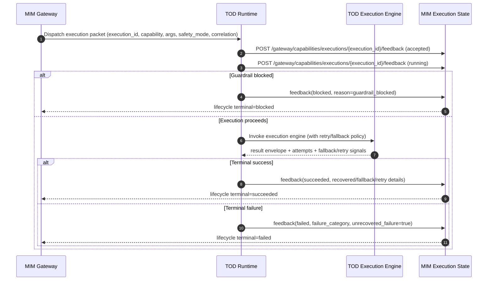
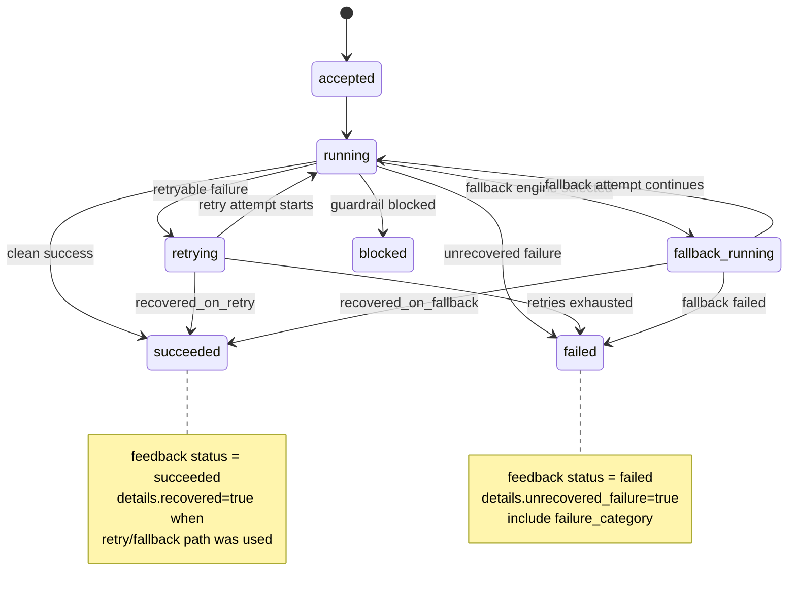

# MIM-TOD Execution Feedback Contract v1

Status: Draft for Objective 22 Task A

Purpose: Define the integration contract for capability execution handoff from MIM to TOD, and lifecycle feedback updates from TOD back to MIM.

## Scope

This contract covers:
- MIM dispatch payload fields required by TOD.
- TOD feedback payload fields posted to MIM lifecycle endpoint.
- Status semantics and outcome mapping.
- Auth/safety boundary requirements for feedback posting.
- End-to-end verification criteria.

## Versioning

- contract_name: mim_tod_execution_feedback_v1
- compatible_with: Objective 22

## 1) MIM -> TOD Execution Handoff Contract

TOD should be able to consume the following execution packet fields without ambiguity.

Required fields:
- execution_id: unique lifecycle id generated by MIM.
- goal_ref: reference to objective/goal context.
- action_ref: reference to action/task/capability request.
- capability: capability name to execute.
- arguments: structured arguments object for capability execution.
- safety_mode: runtime safety mode for TOD execution (for example: strict, standard, permissive).
- correlation: trace metadata for distributed linking.

Recommended payload shape:

```json
{
  "execution_id": "exec_22_0001",
  "goal_ref": "OBJ-0022",
  "action_ref": "TSK-0101",
  "capability": "tod.run_task",
  "arguments": {
    "task_id": "101",
    "package_path": "e:/TOD/tod/out/prompts-v2/101.md"
  },
  "safety_mode": "strict",
  "correlation": {
    "request_id": "req-9ac7",
    "trace_id": "trace-1f02",
    "source": "mim.gateway",
    "issued_at": "2026-03-10T00:00:00Z"
  }
}
```

## 2) TOD -> MIM Feedback Update Contract

Endpoint:
- POST /gateway/capabilities/executions/{execution_id}/feedback

TOD publishes lifecycle updates at key transitions:
- accepted
- running
- succeeded
- failed
- blocked

Recommended feedback payload shape:

```json
{
  "status": "running",
  "source": "tod",
  "task_id": "101",
  "timestamp": "2026-03-10T00:00:04Z",
  "details": {
    "task_category": "implementation",
    "attempted_engines": ["codex"],
    "fallback_used": false,
    "retry_in_progress": false,
    "failure_category": "none",
    "guardrail_blocked": false,
    "recovered": false,
    "unrecovered_failure": false
  }
}
```

## 3) TOD Runtime -> MIM Feedback Status Mapping

Mapping guidance:

- TOD accepted execution: accepted
- TOD starts engine invocation: running
- TOD guardrail blocks pre-invocation: blocked
: details.guardrail_blocked=true, reason=guardrail_blocked
- TOD success with no fallback/retry recovery needed: succeeded
: details.recovered=false
- TOD success after retry/fallback: succeeded
: details.recovered=true, details.fallback_used or retry signal
- TOD executor unavailable/error path: failed
: details.executor_unavailable=true, details.failure_category set
- TOD finishes with revise/escalate terminal review: failed
: details.unrecovered_failure=true

Failure/recovery detail fields:
- executor_unavailable (bool)
- guardrail_blocked (bool)
- retry_in_progress (bool)
- fallback_used (bool)
- recovered (bool)
- unrecovered_failure (bool)
- failure_category (enum-ish string)

## 4) Auth and Safety Boundary

Feedback endpoint should reject unauthorized lifecycle mutation.

Minimum controls:
- Require bearer token for feedback post in non-local environments.
- Associate token scope/role with execution feedback update permission only.
- Validate execution_id exists and is mutable before accepting updates.
- Ignore or reject impossible state transitions (for example succeeded -> running).
- Log actor/source and correlation metadata with every update.

TOD support:
- TOD config can include auth token for feedback publishing.
- If feedback publish is disabled or unavailable, TOD execution still proceeds and logs local outcome.

## 5) End-to-End Integration Test (Promotion Gate)

Pass criteria:
1. MIM dispatches an execution handoff packet with required fields.
2. TOD consumes the packet and begins execution.
3. TOD publishes accepted and running updates.
4. TOD publishes terminal update (succeeded, failed, or blocked).
5. MIM execution lifecycle reflects final terminal state and closes correctly.
6. Correlation metadata links dispatch and all feedback updates.

Suggested E2E runbook:
- Create test execution in MIM gateway.
- Dispatch to TOD with known task id.
- Observe feedback stream in MIM and TOD logs.
- Validate transition chain and terminal close.
- Assert no unauthorized update accepted.

## 6) TOD Implementation Notes (Current)

TOD currently supports feedback publisher wiring in run-task flow with:
- accepted
- running
- blocked (guardrail)
- succeeded/failed terminal mapping

Execution id resolution order:
1. explicit -ExecutionId
2. task.execution_id
3. task.remote_execution_id

## 7) Sequence Diagram



## 8) Retry/Fallback Recovery Diagram


